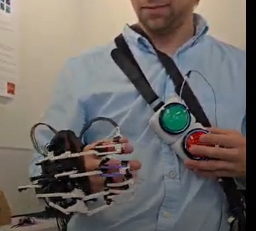

Manual Button State Machine
=============================

This document describes the button-based state machine for manually controlling the **NML Hand Exoskeleton**. The system includes two physical buttons, routed through extension wires, allowing the user to cycle gestures and states in real time without a host PC or BLE device.

Overview
--------

The exoskeleton supports gesture-based motion, where each gesture (e.g., grasp, pinch, point) can have multiple **states** (e.g., "open", "closed"). The system is equipped with two physical buttons:

- **Cycle Gesture Button**: Switches between predefined gestures.
- **Cycle Gesture State Button**: Advances to the next state of the currently selected gesture.

These buttons provide tactile, hands-free switching and are especially useful during wearable operation and rehabilitation trials.

Hardware Setup
--------------

1. **Attach the Button Harness**
   Drape the harness over the user’s shoulder, ensuring the buttons rest comfortably within thumb or index finger reach on the opposite side.

2. **Connect Extension Wires**
   The buttons are connected to the **gesture controller board** via female jumper wires. Refer to the following pin assignments defined in `config.h`:

   - ``CYCLE_GESTURE_PIN = 10``
   - ``GESTURE_STATE_PIN = 11``

   Insert the extension wires into the respective **digital input pins** on the microcontroller.

3. **Power Connection**
   The exoskeleton now includes an in-line **power switch** between the microcontroller and battery pack. To power on:

   - Ensure all servo connectors are firmly attached.
   - Flip the switch to the **ON** position.
   - A status LED (pin ``STATUS_LED_PIN``) will blink once to confirm startup.

4. **System Boot-Up**
   After powering on, the system initializes to the default operating mode:
   - **Default Mode**: ``gesture_fixed`` (see ``DEFAULT_EXO_MODE`` in `config.h`)
   - **Verbose Logging**: Enabled by default for debugging (see ``DEFAULT_VERBOSE``)

Interaction Logic
------------------

- **Short Press on Gesture Button (Pin 10)**
  Cycles to the next gesture in the gesture library. If the last gesture is active, it wraps around to the first.

- **Short Press on State Button (Pin 11)**
  Cycles through the internal states of the current gesture (e.g., open → closed).

- **Debounce Time**
  Both buttons have a software debounce of ``50ms`` to prevent unintended double-presses. This is set using:

  .. code-block::

   constexpr int BUTTON_DEBOUNCE_DURATION = 50;

