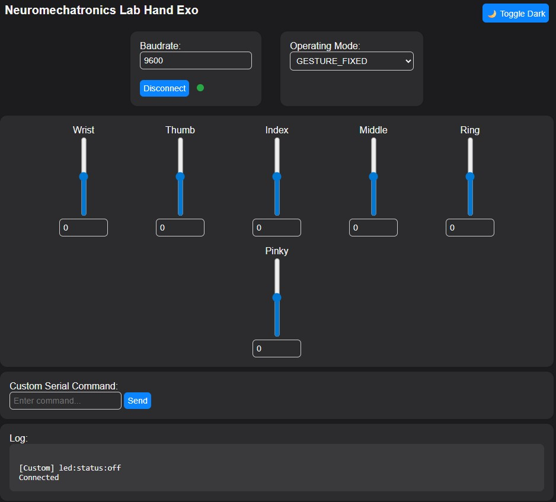

CircuitPython Wi-Fi Server
==========================

This section describes how to set up a Wi-Fi server to exchange data with the NML Hand Exoskeleton. The server supports multiple TCP clients and enables real-time communication with a serially connected exoskeleton.

.. note::
   This server is designed for microcontrollers with Wi-Fi support, such as the Raspberry Pi Pico W. It was tested with Adafruit CircuitPython 9.2.4 (2025-01-29) on the Raspberry Pi Pico 2 W (RP2040).

Software Setup
----------------

1. **Install CircuitPython** on your Raspberry Pi Pico W.
   Visit the `CircuitPython downloads page <https://circuitpython.org/board/raspberry_pi_pico_w/>`_ to download the latest UF2 file. To enter bootloader mode, hold the **BOOTSEL** button while plugging the board into USB. The board will mount as a USB drive (e.g., `RPI-RP2`, `CIRCUITPY`, or `BOOT`).

2. **Flash the board** by dragging and dropping the downloaded `.uf2` file onto the mounted drive. The board will automatically reboot into CircuitPython.

3. **Install the required libraries** by either copying the `lib/` folder to the `CIRCUITPY` drive or downloading the latest CircuitPython library bundle from the `library bundle page <https://circuitpython.org/libraries>`_. Minimum libraries include:

   - `adafruit_ticks.py`
   - `simpleio.py`
   - **adafruit_httpserver**
   - **asyncio**
   - `rgbled.py` # Custom
   - `usbserialreader.py` # Custom
   - `webpage.py` # Custom

4. **Configure Wi-Fi settings** in the `settings.toml` file at the root of the `CIRCUITPY` drive:

   .. code-block:: toml

      CIRCUITPYTHON_WIFI_SSID = "your_wifi_ssid"
      CIRCUITPYTHON_WIFI_PASSWORD = "your_wifi_password"

5. **(Optional) Set a static IP address** by adding the following lines to `settings.toml`:

   .. code-block:: toml

      CIRCUITPYTHON_WIFI_IP = "192.168.1.200"
      CIRCUITPYTHON_WIFI_HTTP_PORT = 5000  # Currently hardcoded in the codebase
      CIRCUITPYTHON_WIFI_TCP_PORT = 5001

   .. note::
      If no static IP is specified, the Pico W will attempt to use DHCP. However, a static IP is recommended for stability in multi-client applications.

Hardware Setup
----------------

The exoskeleton communicates with the Pico W via UART (or USB). Below are the recommended wiring connections between the **Raspberry Pi Pico W** and **OpenRB-150**:

**UART Serial Connection:**

+------------+----------------+---------------------+
| Pico Pin   | OpenRB-150 Pin | Function            |
+============+================+=====================+
| GP16       | RX             | Serial Receive (RX) |
+------------+----------------+---------------------+
| GP17       | TX             | Serial Transmit (TX)|
+------------+----------------+---------------------+
| GND        | GND            | Common Ground       |
+------------+----------------+---------------------+
| VBUS       | V              | 5V Power Supply     |
+------------+----------------+---------------------+

**RGB LED Status Indicator:**

+------------+----------+----------------------+
| Pico Pin   | LED Pin  | Function             |
+============+==========+======================+
| GP10       | CATH     | RGB Common Cathode   |
+------------+----------+----------------------+
| GP11       | R        | Red Channel          |
+------------+----------+----------------------+
| GP12       | G        | Green Channel        |
+------------+----------+----------------------+
| GP13       | B        | Blue Channel         |
+------------+----------+----------------------+

The RGB LED provides server status feedback:
- **Green**: Wi-Fi connected
- **Red**: Disconnected or error
- **Blue**: Client activity (optional)

HTTP Webpage
-----------------

The server hosts a simple HTTP webpage that allows users to control the exoskeleton and view its status. The webpage is served at the root URL (`/`) and provides buttons for enabling/disabling motors, toggling LEDs, and viewing the current state of the exoskeleton.

